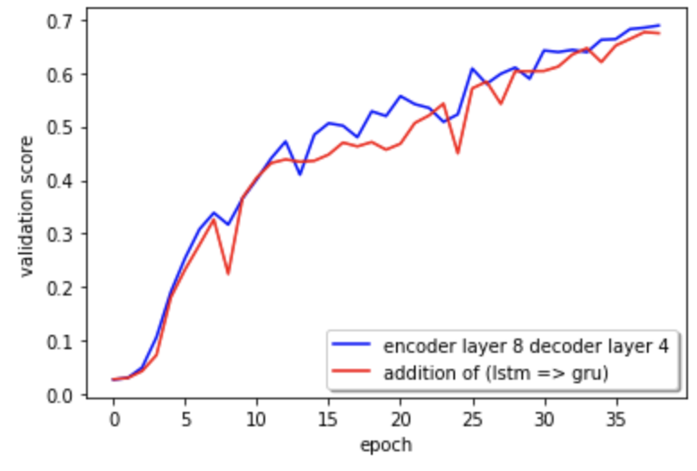
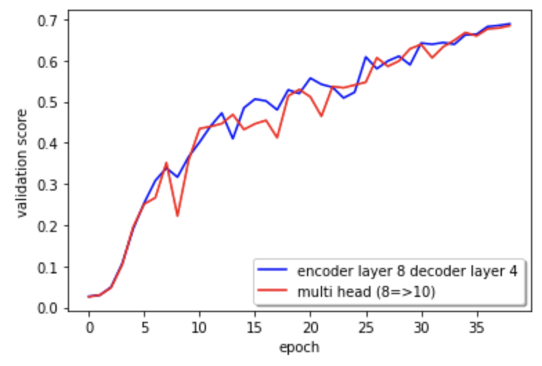

# Mathematical Expression Recognizer
## Overview

> '**여러 라인의 text를 인식해야한다는 점**'에서 기존 OCR과 차이점을 보임

<p align="center"></p>

## Evaluation Metrics

> **0.9 * "문장 단위 정확도" + 0.1 * "(1-단어 오류율)"**

- **문장 단위 정확도**
    - (100% 일치한 문장수 / 전체 문장수)

- **단어 오류율**
    - 단어 단위의 편집 거리(edit distance)를 이용하여 계산

## Dataset Overview

- **train dataset**

    > 총 10만장으로써 손글씨 5만장, 인쇄물 5만장으로 구성됨
    - `gt.txt`
    
        > "파일 경로" \t "latex 수식"
    - `source.txt`
    
        > "파일 경로" \t "source type"
        - source
            - 0 – 출력물, 1 – 손글씨
    - `level.txt`
    
        > "파일 경로" \t "level"
        - level
            - 1 - 초등, 2 - 중등, 3 - 고등, 4 - 대학, 5 - 대학 이상
- **test dataset**
    > 총 12,000장으로써 손글씨 6천장, 인쇄물 6천장으로 구성됨

## Code Overview

```
/code

	configs/ # train/test environment 설정

	data_tools/ # 데이터 전처리

	networks/ # 모델 파일들

	train.py # 모델 학습

	test.py # 모델 테스트 및 대회 제출 파일 생성

	dataset.py # 데이터 로딩

	... # 기타 helper 함수들
```

## Data Analysis & Data Augmentation

<p align="center"></p>

- **Image Resizing With Aspect Ratio (1:4.146)**
    - Mean Aspect Ratio
        - (Image Width : Image Height = 4.146 : 1)
        <p align="center"></p>
    - `config file (Attention.yaml, SATRN.yaml)`
    
        ```
        input_size: # mean ratio => 1:4.146
            height: 64
            width: 256
        ```
    - `train.py`
    
        ```
        # Resize so all images have the same size
        # in aspect ratio
            transforms.Resize((options.input_size.height, options.input_size.width)),
        ```
- **Image Rectification**

    - 이미지가 뒤틀린 정도를 보정해 recognize하기 쉬운 상태로 전처리

    <p align="center"></p>
    
    - 문제점
        - 이미 Text Localization이 완료된 dataset이 주어짐
        - 수식의 특성상 Rotation을 실행할 경우, 특정 글자가 잘려서 인식 오류가 발생할 가능성 농후
    - 해결책
        - Padding을 통해 여백을 만듦
            - 이때 여백을 비대칭으로 만들어서 transition 효과를 얻음
            - 이때 여백을 비대칭으로 만들어서 transition 효과를 얻음
            - 인식의 편리성을 위해 padding된 부분을 255 값으로 채움
    - `train.py`

        ```
        class SquarePad:
            def __call__(self, image):
                padding = (20, 10, 15, 10)
                return F.pad(image, padding, 255, 'constant')
        ```
        
        ```
        SquarePad(),
        transforms.RandomRotation(degrees=(-5, 5)), # degree
        ```
- **GaussianBlur**

    - `train.py`
    
        ```
        transforms.GaussianBlur(3),
        ```

## Model Tuning

- **baseline code 오류 수정**

    - `SATRN.py` (TransformerDecoderLayer 클래스의 forward 함수)
        - 수정 전: `att = self.attention_layer(tgt, src, src)`
        - 수정 후: `att = self.attention_layer(out, src, src)`
        - 2가지 source attention 값을 병합하는 2개의 branch 구조
→ 2가지 source attention 값을 병합하는 1개의 branch 구조

1. **encoder layer 8 decoder layer 4**

    - SATRN에서 가장 핵심적인 부분은 encoder 부분
    - input image를 프로세싱하기 위해 Shallow CNN Block을 사용
        - 이는 기본적인 패턴 및 구성 정보를 추출해내고 추상화하는 과정을 통해 연산부담을 줄여줌
    - 수식을 인식하는것은 패턴이 어느정도 구조화 되어있다고 판단
    - encoder layer를 늘려서 조금 더 기본적인 패턴 및 구성정보를 추출하면 좋아지지 않을까 라고 판단
    - 따라서, encoder layer를 늘리고 이에 상응하게 decoder layer 또한 늘림
    - 성능 향상
        <p align="center"></p>
        
2. **LSTM → GRU**

    - 기본 셀이 LSTM 으로 설정되있었기 때문에 GRU 셀에 대한 비교 실험을 진행
    - 성능이 오히려 하락
        <p align="center"></p>
        
3. **multi head 수 늘림**

    - 성능이 오히려 하락
        <p align="center"></p>
    - 이유에 대해선 검증하지 못하였지만 
아마 생각보다 단순한 패턴에 head수를 늘리는게 좋은 시도가 아니였다고 판단

- `config file`
    <p align="center"></p>
    
# Model Serving using Chrome Extension

## demo
<p align="center"></p>

## 실행
### Server (server 폴더)
학습된 모델을 다운 받아 server/checkpoints 디렉토리 안에 넣습니다.

- [SATRN](https://drive.google.com/file/d/1-3-Of5bZk5zxwZuetUwpK1VgPVwdhqob/view?usp=sharing)

```
pip install -r requirements.txt
python main.py
```


### Chrome Extension (boost_susik 폴더)
1. 위에서 서버를 시작한 다음 그에 대응하는 URL을 `content.js` 상단에 변수로 넣습니다.
    ```
    const SERVERL_URL='http://<YOUR_SERVER_IP>:<YOUR_SERVER_PORT>/susik_recognize';
    ```
2.  크롬 주소창에 `chrome://extensions/` 다음 주소를 입력하고, 
`boost_susik`이라는 폴더를 `압축해제된 확장 프로그램을 로드합니다.` 버튼을 클릭하여 로드합니다.

### Mixed Content Error
- HTTPS로 되어있는 웹사이트에서 서버 (HTTP)로 요청을 보내면 mixed content error가 뜨면서 요청이 보내지지 않습니다. 이런경우 크롬에서 서버 주소를 허용해주는 식으로 우회를 합니다.
  - 크롬에서 `chrome://flags/#unsafely-treat-insecure-origin-as-secure` 에 현재 서버 주소를 입력하는 식으로 우회합니다.
